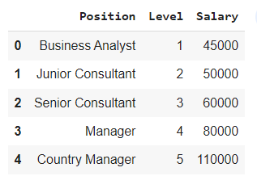
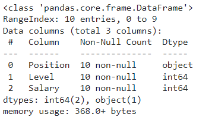
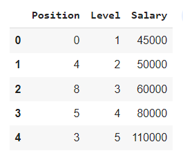

# Implementation-of-Decision-Tree-Regressor-Model-for-Predicting-the-Salary-of-the-Employee

# AIM:
To write a program to implement the Decision Tree Regressor Model for Predicting the Salary of the Employee.

# Equipments Required:
1. Hardware – PCs
2. Anaconda – Python 3.7 Installation / Jupyter notebook

# Algorithm
### Step1:
Import the required libraries.
### Step2:
Upload the csv file and read the dataset.
### Step3: 
Check for any null values using the isnull() function.
### Step4:
From sklearn.tree inport DecisionTreeRegressor.
### Step5: 
Import metrics and calculate the Mean squared error.
### Step6: 
Apply metrics to the dataset, and predict the output.

# Program:
/*
Program to implement the Decision Tree Regressor Model for Predicting the Salary of the Employee.

Developed by: ISHAQ HUSSAIN A

Register Number: 212221040059

*/
```python
import pandas as pd
data=pd.read_csv("Salary.csv")
data.info()
data.isnull().sum()
from sklearn.preprocessing import LabelEncoder
le=LabelEncoder()
data["Position"]=le.fit_transform(data["Position"])
data.head()
x = data[["Position","Level"]]
y = data["Salary"]
from sklearn.model_selection import train_test_split
x_train,x_test,y_train,y_test=train_test_split(x,y,test_size=0.2,random_state=2)
from sklearn.tree import DecisionTreeRegressor
dt=DecisionTreeRegressor()
dt.fit(x_train,y_train)
y_pred=dt.predict(x_test)
from sklearn import metrics
mse=metrics.mean_squared_error(y_test,y_pred)
mse
r2=metrics.r2_score(y_test,y_pred)
r2
dt.predict([[5,6]])
```
# Output:

### Initial Dataset:

### Data Info:



### Encoded Dataset:

### MSE Value:


### R Squared Value:

### Data Prediction:


# Result:
Thus the program to implement the Decision Tree Regressor Model for Predicting the Salary of the Employee is written and verified using python programming.
